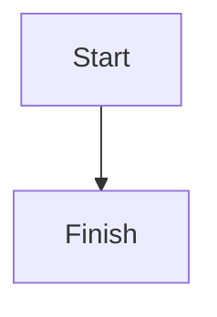

# WhizMD User Guide

WhizMD is a desktop Markdown editor. It provides a writing experience similar to a WYSIWYG editor while preserving standard Markdown files, making it suitable for documentation, technical notes, project documents, and everyday writing.

## Contents

- [Getting Started](#getting-started)
- [Interface Overview](#interface-overview)
- [Document Management](#document-management)
- [Editing Modes](#editing-modes)
- [Markdown Features](#markdown-features)
- [Images](#images)
- [Code Blocks](#code-blocks)
- [Exporting Documents](#exporting-documents)
- [Themes and Language](#themes-and-language)
- [Keyboard Shortcuts](#keyboard-shortcuts)
- [Development and Builds](#development-and-builds)
- [Troubleshooting](#troubleshooting)

## Getting Started

### Installing a Packaged Version

Windows builds include the following packages:

- NSIS installer: recommended for a normal installation. You can choose the installation directory, and a desktop shortcut is created by default.
- ZIP archive: extract it and run the application directly for a portable installation.

### Running from Source

Install Node.js and npm, then run the following commands from the project directory:

```bash
npm install
npm run dev
```

`npm run dev` starts the Electron development window with hot reload enabled for the renderer process.

## Interface Overview

The application window contains the following main areas:

- Top toolbar: create and save documents, switch editing modes, and configure the theme and language.
- Left sidebar: lists open documents and the file tree for an opened folder.
- Main editor area: displays either the WYSIWYG editor or the Markdown source editor.

The window title is updated from the current file name. Unsaved documents are marked with `*` before their name in the Opened Files list.

## Document Management

### Creating a Document

Click `New` in the toolbar, or press `Ctrl+N` (`Cmd+N` on macOS). The new document starts empty. The first time you save it, WhizMD asks you to choose a file path.

### Opening a File

Click `Open File`, or press `Ctrl+O` (`Cmd+O` on macOS), and select a Markdown file. WhizMD adds the file to the Opened Files list. If the file is already open, the application switches to that document instead.

WhizMD can open common Markdown text files with `.md`, `.markdown`, and `.txt` extensions. Saving preserves the selected file path.

### Opening a Folder

Click `Open Folder` and choose a directory. The directory appears in the file tree in the left sidebar. Expand directories and click a file to open it. Opening a folder does not automatically open every file inside it.

### Switching Documents

Click a document in the Opened Files list to switch to it. Each document independently tracks:

- File path
- Current content
- Unsaved state

Unsaved content is preserved while switching between documents or editing modes during the current application session.

### Saving a Document

Click `Save`, or press `Ctrl+S` (`Cmd+S` on macOS). When saving an untitled document for the first time, a save dialog opens with `untitled.md` as the default file name.

After a successful save, the unsaved marker disappears. If a folder is open, the file tree is rescanned after saving.

### Closing a Document

Choose `File > Close`, or press `Ctrl+W` (`Cmd+W` on macOS).

If the current document has unsaved changes, WhizMD provides these options:

- Save and close: save the document, then close it.
- Discard changes: close the document without saving the current changes.
- Cancel: return to the editor.

When the last document is closed, WhizMD automatically creates a new empty document so the editor always has an active document.

When closing the application window, WhizMD also prompts if any document has unsaved changes.

## Editing Modes

### WYSIWYG Mode

Click `WYSIWYG` in the toolbar to enter WYSIWYG mode. Markdown is displayed as formatted content, making this mode suitable for everyday writing and visual review.

You can directly edit headings, paragraphs, lists, tables, links, images, formulas, and code blocks. The application still saves the content as Markdown rather than a proprietary document format.

### Source Mode

Click `Source` in the toolbar to enter source mode. Source mode uses CodeMirror and is useful for:

- Precisely adjusting Markdown markers.
- Editing complex code blocks, HTML, Mermaid, or formulas.
- Viewing and modifying the complete Markdown source.

Source mode supports Markdown-aware editing, code fence language completion, and indentation handling. Changes are synchronized with WYSIWYG mode, and switching modes does not discard unsaved changes.

## Markdown Features

WhizMD uses GitHub Flavored Markdown (GFM) and supports:

- Headings, paragraphs, blockquotes, and horizontal rules
- Bold, italic, strikethrough, and inline code
- Ordered and unordered lists
- Tables
- Links and images
- Inline HTML
- Code blocks and syntax highlighting
- Mermaid diagrams
- KaTeX mathematics
- Footnotes
- Reference link definitions
- Definition lists
- GitHub-style alert blocks

### Alert Blocks

In source mode, use the following syntax:

```markdown
> [!NOTE]
> This is a regular note.
```

Supported alert types are `NOTE`, `TIP`, `IMPORTANT`, `WARNING`, and `CAUTION`. In WYSIWYG mode, typing a marker such as `> [!NOTE]` can also trigger an alert block.

### Footnotes

Example footnote reference and definition:

```markdown
This sentence has a footnote[^1].

[^1]: This is the footnote content.
```

In WYSIWYG mode, clicking a footnote reference jumps to its definition. The footnote definition area provides controls to return to the reference or delete the definition.

### Definition Lists

Definition lists use a term followed by `: `:

```markdown
Term
: Definition of the term
```

In WYSIWYG mode, type a term, press Enter, and then type `: ` to trigger a definition list. The term can be edited separately in the definition list module.

### Reference Link Definitions

Link destinations can be defined at the end of the document and referenced from the body:

```markdown
[Project home][project]

[project]: https://example.com "Project home"
```

## Images

### Inserting Images

WYSIWYG mode supports the following image operations:

- Drag an image file into the editor.
- Paste a screenshot or another image from the clipboard.
- Type or edit image Markdown directly in source mode.

Supported image formats include PNG, JPEG, GIF, SVG, WebP, BMP, ICO, and AVIF.

### Image Paths

When an image is dragged or pasted into a saved Markdown document, WhizMD imports it into a document-related asset directory and stores a usable image path in the Markdown. Images inserted into an untitled document are temporarily stored in the application asset library; saving the document first is recommended before organizing the document and its image assets.

The image module allows you to edit the alt text, image source, and display size, or delete the image.

When moving a Markdown file, move its referenced image assets as well. Otherwise, the images may no longer be displayed.

## Code Blocks

### Creating a Code Block

In WYSIWYG mode, type three backticks:

````markdown
```javascript
console.log('Hello, WhizMD')
```
````

After you finish the opening code fence, WhizMD displays a language selection menu. You can also edit the fence and language name directly in source mode.

The language menu currently includes:

- Mermaid
- JavaScript and TypeScript
- Python, Java, Go, and Rust
- JSON, HTML, CSS, SQL, and Shell
- Plain text

Other languages can still be entered through a fence language name in source mode. Generic languages use lowlight when a matching grammar is available.

### Editing Code Blocks

- Press `Enter`: create a new line with the current line's leading whitespace.
- Press `Tab`: insert two spaces.
- Press `Shift+Tab`: remove up to two leading spaces from the current line.
- Generic code blocks provide a `Copy` button.

HTML, Mermaid, and generic code blocks use the same indentation behavior: new lines inherit the current line's indentation instead of inferring nested HTML levels.

### Mermaid Diagrams

Set the code block language to `mermaid` to create a Mermaid diagram:

````markdown

````

WYSIWYG mode displays the rendered diagram while keeping the Mermaid source editable. If the diagram syntax is invalid, an error is shown in the diagram area. Check the Mermaid source to resolve it.

### HTML Preview

Set the code block language to `html` to display an HTML preview while keeping the source editable. The preview runs in a sandboxed iframe; scripts and unsafe capabilities are restricted rather than executed like a normal page.

HTML containers can also contain embedded Markdown content. HTML content is sanitized for safety, so do not treat untrusted content as executable code.

## Mathematics

WhizMD uses KaTeX to render mathematical formulas.

Inline formula example:

```markdown
Einstein's formula: $E = mc^2$
```

Block formula example:

```markdown
$$
\int_0^1 x^2\,dx = \frac{1}{3}
$$
```

The formula source remains in the Markdown file. If a formula does not render, check its LaTeX syntax. KaTeX attempts to render all syntax it can recognize.

## Exporting Documents

The `File` menu provides:

- `Export HTML`
- `Export PDF`

The default export path is based on the current Markdown file name. For example, `notes.md` suggests `notes.html` or `notes.pdf`. An untitled document uses `untitled.html` or `untitled.pdf` by default.

Exported content re-renders Markdown, code blocks, mathematics, images, and Mermaid diagrams. HTML exports include the required styles; Mermaid diagrams are rendered to local SVG when possible and do not depend on an external CDN.

## Themes and Language

### Themes

Click the theme button on the right side of the toolbar to cycle through:

1. System
2. Light
3. Dark

The theme setting affects the application interface and the source editor theme.

### Language

Click the language menu in the toolbar to choose:

- System
- Chinese
- English

When set to System, Chinese system locales use the Chinese interface and other system locales use English. The menu and application interface update immediately.

## Keyboard Shortcuts

| Action | Windows / Linux | macOS |
| --- | --- | --- |
| New document | `Ctrl+N` | `Cmd+N` |
| Open file | `Ctrl+O` | `Cmd+O` |
| Save | `Ctrl+S` | `Cmd+S` |
| Close current document | `Ctrl+W` | `Cmd+W` |
| Undo | `Ctrl+Z` | `Cmd+Z` |
| Redo | `Ctrl+Shift+Z` | `Cmd+Shift+Z` |
| Cut | `Ctrl+X` | `Cmd+X` |
| Copy | `Ctrl+C` | `Cmd+C` |
| Paste | `Ctrl+V` | `Cmd+V` |
| Select all | `Ctrl+A` | `Cmd+A` |

## Development and Builds

Run the following commands from the project root:

| Command | Purpose |
| --- | --- |
| `npm install` | Install project dependencies |
| `npm run dev` | Start Electron in development mode |
| `npm run build` | Build the main, preload, and renderer processes |
| `npm run start` | Preview the production build |
| `npm run dist` | Build the application and generate Windows installers and a ZIP archive |
| `npm run typecheck` | Run TypeScript checks |
| `npm run lint` | Run ESLint checks |
| `npm run format` | Format the project with Prettier |
| `npm test` | Run the Vitest test suite |

Windows release artifacts are written to the `release/` directory in the project root.

## Troubleshooting

### Why does Save not open a file path dialog?

The save dialog opens only the first time an untitled document is saved. Previously saved documents are written directly to their original path. To save a copy elsewhere, use the operating system's file manager to copy the file, or create a new document and save it to a new path.

### Why is a document marked as unsaved?

After editing, the document is marked as unsaved and `*` appears before its name in the sidebar. Press `Ctrl+S` or `Cmd+S` to save. If saving fails, check whether another application has locked the file and whether the current directory is writable.

### Why are images missing after moving a file?

Images are commonly referenced using relative paths. When moving a Markdown file, preserve the relative location of its image asset directory, or update the image source in the image module.

### Why is a Mermaid diagram not rendered?

Make sure the code block language is `mermaid`, then check the diagram syntax, node names, and connections. Syntax errors are reported in the diagram area.

### Why does HTML code not execute as expected?

HTML code blocks are intended for safe previews. The preview runs in a sandbox, so scripts and other unsafe capabilities are restricted. For static HTML, avoid depending on external scripts or page-level runtime behavior.

### How do I report a problem?

When reporting an issue, include:

- The WhizMD version or commit version.
- The operating system version.
- The Markdown content or a minimal example that reproduces the problem.
- Detailed reproduction steps and any error messages.
- Whether the problem occurs only in WYSIWYG mode or only in source mode.
