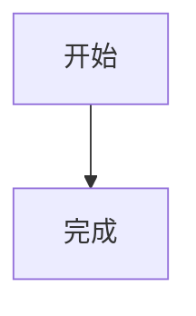

# WhizMD 使用帮助

WhizMD 是一款桌面 Markdown 编辑器。它提供类似所见即所得编辑器的写作体验，同时保留标准 Markdown 文件格式，适合编写说明文档、技术笔记、项目文档和日常记录。

## 目录

- [快速开始](#快速开始)
- [界面说明](#界面说明)
- [文档管理](#文档管理)
- [编辑模式](#编辑模式)
- [Markdown 功能](#markdown-功能)
- [图片](#图片)
- [代码块](#代码块)
- [导出文档](#导出文档)
- [主题和语言](#主题和语言)
- [快捷键](#快捷键)
- [开发和构建](#开发和构建)
- [常见问题](#常见问题)

## 快速开始

### 安装已构建版本

Windows 构建版本包含以下文件：

- NSIS 安装程序：适合正常安装使用，可选择安装目录，并默认创建桌面快捷方式。
- ZIP 压缩包：解压后直接运行，适合免安装使用。

### 从源代码运行

需要先安装 Node.js 和 npm，然后在项目目录执行：

```bash
npm install
npm run dev
```

`npm run dev` 会启动 Electron 开发窗口，并支持渲染进程热更新。

## 界面说明

应用窗口主要由以下区域组成：

- 顶部工具栏：新建、保存、编辑模式切换、主题和语言设置。
- 左侧边栏：显示已打开的文档，以及已打开文件夹中的文件树。
- 中央编辑区：根据当前模式显示所见即所得编辑器或 Markdown 源码编辑器。

当前文档标题会根据文件名自动更新。未保存的文档在左侧“已打开文件”列表中以 `*` 标记。

## 文档管理

### 新建文档

选择工具栏中的“新建”，或按 `Ctrl+N`（macOS 为 `Cmd+N`）。新文档初始为空，第一次保存时会要求选择文件路径。

### 打开文件

选择“打开文件”，或按 `Ctrl+O`（macOS 为 `Cmd+O`），然后选择 Markdown 文件。应用会将文件加入已打开文档列表；如果文件已经打开，则直接切换到该文档。

应用可以打开常见的 Markdown 文本文件，包括 `.md`、`.markdown` 和 `.txt` 文件。保存时会保留你选择的文件路径。

### 打开文件夹

选择“打开文件夹”，然后选择一个目录。目录会显示在左侧文件树中，展开目录后可以点击文件打开。打开文件夹不会自动打开其中的所有文件。

### 切换文档

在左侧“已打开文件”列表中点击文档即可切换。每个文档独立保存以下状态：

- 文件路径
- 当前编辑内容
- 是否有未保存修改

切换文档或编辑模式时，应用会保留当前会话中的未保存内容。

### 保存文档

选择“保存”，或按 `Ctrl+S`（macOS 为 `Cmd+S`）。未命名文档第一次保存时会弹出保存对话框，默认文件名为 `untitled.md`。

保存成功后，文档的未保存标记会消失。保存后如果文件夹已打开，左侧文件树会重新扫描。

### 关闭文档

选择菜单“文件 > 关闭”，或按 `Ctrl+W`（macOS 为 `Cmd+W`）。

如果当前文档有未保存修改，应用会提供以下选择：

- 保存并关闭：保存成功后关闭文档。
- 放弃修改：不保存当前修改并关闭文档。
- 取消：返回编辑器。

关闭最后一个文档后，应用会自动创建一个新的空白文档，避免编辑区没有活动文档。

关闭窗口时，如果存在未保存文档，应用也会先进行提示。

## 编辑模式

### 所见即所得模式

顶部工具栏中的“编辑”按钮进入所见即所得模式。Markdown 会以排版后的形式显示，适合日常写作和检查文档效果。

在该模式下可以直接编辑标题、段落、列表、表格、链接、图片、公式和代码块。应用仍会将内容保存为 Markdown，而不是保存为专有格式。

### 源码模式

顶部工具栏中的“源码”按钮进入源码模式。源码模式使用 CodeMirror 编辑器，适合：

- 精确调整 Markdown 标记。
- 编辑复杂的代码块、HTML、Mermaid 或公式。
- 查看和修改文档的完整 Markdown 内容。

源码模式支持 Markdown 感知的编辑行为、代码围栏语言补全和缩进处理。编辑内容会与所见即所得模式同步，切换模式不会丢失未保存修改。

## Markdown 功能

WhizMD 使用 GitHub 风格 Markdown（GFM）并支持以下内容：

- 标题、段落、引用和分隔线
- 粗体、斜体、删除线、行内代码
- 有序列表和无序列表
- 表格
- 链接和图片
- 图片链接，并可分别编辑图片地址和跳转地址
- 行内 HTML
- 代码块和语法高亮
- Mermaid 图表
- KaTeX 数学公式
- 脚注
- 引用链接定义
- 定义列表
- GitHub 风格提示块

### 提示块

在源码模式中可以使用以下语法：

```markdown
> [!NOTE]
> 这是一条普通提示。
```

支持的提示类型为 `NOTE`、`TIP`、`IMPORTANT`、`WARNING` 和 `CAUTION`。在所见即所得模式中，也可以输入 `> [!NOTE]` 等标记触发提示块。

### 脚注

脚注引用和定义示例：

```markdown
这是一段带脚注的文字[^1]。

[^1]: 这是脚注内容。
```

在所见即所得模式中点击脚注引用可以跳转到对应的脚注定义；脚注定义区域提供返回引用和删除操作。

### 定义列表

定义列表使用术语后接 `: ` 的格式：

```markdown
术语
: 术语的解释
```

在所见即所得模式中，输入术语后换行，再输入 `: ` 可以触发定义列表。定义列表的术语可以单独编辑。

### 引用链接定义

可以将链接地址集中定义在文档末尾，然后在正文中引用：

```markdown
[项目主页][project]

[project]: https://example.com "项目主页"
```

## 图片

### 插入图片

所见即所得模式支持以下图片操作：

- 将图片文件拖入编辑区。
- 从剪贴板粘贴截图或其他图片。
- 在源码模式中直接输入或修改图片 Markdown。

支持的图片格式包括 PNG、JPEG、GIF、SVG、WebP、BMP、ICO 和 AVIF。

### 图片路径

保存 Markdown 文档时，WhizMD 会尽量保持图片路径与 GitHub 仓库兼容：

- 位于 Markdown 文件目录、子目录或所属 Git 仓库内的图片会保留原位置。
- `../images/logo.png` 这类相对路径会保留。
- 仓库外的本地图片只有在确实需要迁移时，才会复制到 Markdown 文件同级的 `assets/` 目录。
- 没有图片需要迁移时不会创建 `assets/` 目录。
- 空格和其他非法 URL 字符会被编码，例如 `my image.png` 会保存为 `my%20image.png`。
- 已有资源不会被覆盖，重名文件会自动添加数字后缀。

未命名文档中的图片会暂存到应用资源库；建议先保存文档，再整理文档和图片资源的位置。

在图片模块中可以修改图片说明文字、图片地址、图片标题和显示尺寸，也可以删除图片。图片链接还可以额外编辑跳转地址。

移动 Markdown 文件时，请保留图片在仓库中的相对位置。对于位于 `assets/` 中的图片，请将该目录与 Markdown 文件一起移动。

## 代码块

### 创建代码块

在所见即所得模式中输入三个反引号：

````markdown
```javascript
console.log('Hello, WhizMD')
```
````

在输入结束的代码围栏后，应用会显示代码语言选择菜单。也可以在源码模式中直接编辑围栏和语言名称。

当前界面提供以下语言选项：

- Mermaid
- JavaScript、TypeScript
- Python、Java、Go、Rust
- JSON、HTML、CSS、SQL、Shell
- 纯文本

其他语言仍可以在源码模式中通过围栏语言名称输入；普通语言会使用 lowlight 尝试进行语法高亮。

### 代码块编辑操作

- 按 `Enter`：新行继承当前行的前导空格。
- 按 `Tab`：插入两个空格。
- 按 `Shift+Tab`：删除当前行开头最多两个空格。
- 普通代码块提供“复制”按钮。

HTML、Mermaid 和普通代码块统一按当前行继承缩进，不会根据嵌套标签自动推断 HTML 层级。

### Mermaid 图表

将代码块语言设为 `mermaid` 即可创建 Mermaid 图表：

````markdown

````

所见即所得模式会显示图表预览，同时保留 Mermaid 源码供编辑。图表语法错误时会显示错误提示，需检查 Mermaid 源码。

### HTML 预览

将代码块语言设为 `html` 可以显示 HTML 预览，并保留源码编辑能力。预览运行在沙箱 iframe 中；脚本和不安全内容不会按普通页面直接执行。

HTML 容器内部也可以嵌入 Markdown 内容，但应注意 HTML 内容会经过安全处理。不要将不可信内容当作可执行代码使用。

## 数学公式

WhizMD 使用 KaTeX 渲染数学公式。

行内公式示例：

```markdown
爱因斯坦公式：$E = mc^2$
```

块级公式示例：

```markdown
$$
\int_0^1 x^2\,dx = \frac{1}{3}
$$
```

公式源码仍会保存在 Markdown 中。若公式无法渲染，请检查 LaTeX 语法；KaTeX 会尽量显示可识别的内容。

## 导出文档

通过菜单“文件”可以使用：

- 导出 HTML
- 导出 PDF

导出默认使用当前 Markdown 文件名：例如 `notes.md` 会建议保存为 `notes.html` 或 `notes.pdf`。未命名文档默认使用 `untitled.html` 或 `untitled.pdf`。

导出内容会重新渲染 Markdown、代码块、数学公式、图片和 Mermaid 图表。HTML 导出会包含必要的样式；Mermaid 图表会在可行时生成本地 SVG，不依赖外部 CDN。

## 主题和语言

### 主题

点击工具栏右侧的主题按钮可以循环切换：

1. 跟随系统
2. 浅色主题
3. 深色主题

主题设置会影响应用界面和源码编辑器主题。

### 语言

点击工具栏中的语言菜单可以选择：

- 跟随系统
- 中文
- English

跟随系统时，中文系统使用中文界面，其他系统使用英文界面。菜单语言和应用界面语言会即时更新。

## 快捷键

| 操作 | Windows / Linux | macOS |
| --- | --- | --- |
| 新建文档 | `Ctrl+N` | `Cmd+N` |
| 打开文件 | `Ctrl+O` | `Cmd+O` |
| 保存 | `Ctrl+S` | `Cmd+S` |
| 关闭当前文档 | `Ctrl+W` | `Cmd+W` |
| 撤销 | `Ctrl+Z` | `Cmd+Z` |
| 重做 | `Ctrl+Shift+Z` | `Cmd+Shift+Z` |
| 剪切 | `Ctrl+X` | `Cmd+X` |
| 复制 | `Ctrl+C` | `Cmd+C` |
| 粘贴 | `Ctrl+V` | `Cmd+V` |
| 全选 | `Ctrl+A` | `Cmd+A` |

## 开发和构建

在项目根目录执行以下命令：

| 命令 | 作用 |
| --- | --- |
| `npm install` | 安装项目依赖 |
| `npm run dev` | 启动 Electron 开发模式 |
| `npm run build` | 构建主进程、预加载脚本和渲染进程 |
| `npm run start` | 预览生产构建结果 |
| `npm run dist` | 构建并生成 Windows 安装包和 ZIP 压缩包 |
| `npm run typecheck` | 执行 TypeScript 类型检查 |
| `npm run lint` | 执行 ESLint 检查 |
| `npm run format` | 使用 Prettier 格式化项目 |
| `npm test` | 执行 Vitest 测试 |

Windows 发布产物位于项目根目录的 `release/` 文件夹。

## 常见问题

### 为什么保存按钮没有弹出路径选择框？

只有未命名文档第一次保存时才会弹出保存对话框。已经保存过的文档会直接写回原文件；如果需要另存为其他路径，请使用操作系统文件管理器复制文件，或在应用中创建新文档后保存到新路径。

### 为什么文档显示为未保存？

编辑后文档会标记为未保存，并在左侧文件名之前显示 `*`。按 `Ctrl+S` 或 `Cmd+S` 保存即可。若保存失败，应用会显示错误提示，请检查文件是否被其他程序占用以及当前目录是否有写入权限。

### 为什么图片在移动文件后无法显示？

图片通常通过相对路径引用。移动 Markdown 文件时，请保留图片资源目录的相对位置，或者在图片模块中重新设置图片地址。

### 为什么 Mermaid 图表没有渲染？

请确认代码块语言是 `mermaid`，并检查图表语法、节点名称和连线格式。语法错误会在图表区域显示提示。

### 为什么 HTML 代码没有按预期执行？

HTML 代码块主要用于安全预览。预览运行在沙箱环境中，脚本等不安全能力会受到限制。需要展示静态 HTML 时，请避免依赖外部脚本和页面级运行环境。

### 如何报告问题？

提交问题时建议附上以下信息：

- WhizMD 版本或提交版本。
- 操作系统版本。
- 复现问题的 Markdown 内容或最小示例。
- 详细复现步骤和错误提示。
- 是否只在所见即所得模式或源码模式中出现。
